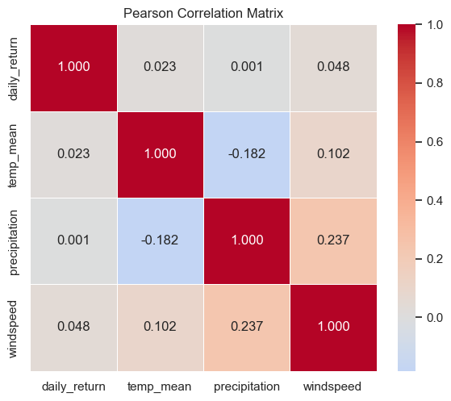
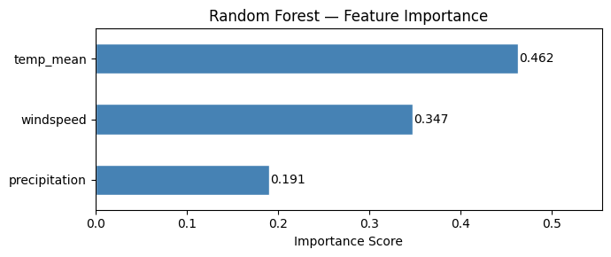

# Does Weather Affect the Stock Market? A BIST 100 Analysis
## DSA210 Final Report
**Rıza Emre Aksoy (31977) — Sabancı University — Spring 2026**

---

## 1. Motivation

Behavioral finance literature has long proposed that environmental factors can influence investor psychology and, by extension, market outcomes. Saunders (1993) found a statistically significant relationship between New York City cloud cover and stock returns on the NYSE, suggesting that bad weather depresses investor mood and leads to more conservative (pessimistic) trading decisions. Hirshleifer and Shumway (2003) extended this finding across 26 international markets, confirming that sunshine is positively correlated with daily stock returns in most cities studied, even after controlling for other seasonal effects.

The mechanism is straightforward: weather affects mood, mood affects risk appetite, and risk appetite affects trading behavior. Given that Borsa Istanbul is physically located in Istanbul, local weather constitutes a natural and clean experimental variable. If the weather-mood-trading channel is real, it should be detectable using Istanbul's daily meteorological data matched against BIST 100 returns. This project treats that match as a falsifiable hypothesis and tests it with both statistical and machine learning methods over a two-year window of post-COVID "normal" market conditions.

---

## 2. Data Sources

**BIST 100 (XU100.IS):** Daily closing prices fetched via the `yfinance` Python library for the period 2023-01-01 to 2024-12-31. Daily returns were computed as the percentage change in closing price. The 2023–2024 window was chosen because Open-Meteo's archive API provides reliable historical data for this range, and this period reflects post-pandemic market normality without the extreme volatility of 2020–2022.

**Istanbul Weather:** Daily meteorological data retrieved from the Open-Meteo Historical Archive API at coordinates 41.0082°N, 28.9784°E. Three variables were collected: mean daily temperature (°C), total precipitation (mm), and maximum windspeed at 10m (km/h).

**Merged Dataset:** The two sources were joined on date using an inner join, retaining only trading days (excluding weekends and holidays). The final dataset contains **496 trading days**.

---

## 3. Data Analysis

### 3.1 Exploratory Data Analysis

Descriptive statistics revealed that BIST 100 daily returns exhibit heavy tails and are not normally distributed — a typical characteristic of financial return series. Scatter plots of each weather variable against daily return showed no visible linear or nonlinear pattern. A correlation heatmap confirmed that all pairwise absolute correlations between weather variables and returns were below 0.05, suggesting negligible linear association even before formal testing.

*Figure 1: Correlation heatmap showing pairwise linear associations. All weather-return correlations are below 0.05 in absolute value.*

### 3.2 Hypothesis Testing

Three families of hypothesis tests were applied, all at significance level α = 0.05:

**Pearson Correlation (continuous weather variables vs. daily return):**

| Variable | r | p-value |
|---|---|---|
| Mean Temperature | 0.0231 | 0.6080 |
| Precipitation | 0.0008 | 0.9853 |
Max Windspeed | 0.0480 | 0.2857 |

All correlations are close to zero and none approach statistical significance.

**Mann-Whitney U Test (rainy vs. dry days):** Days with any precipitation were classified as "rainy" and the rest as "dry." A non-parametric test was used because precipitation is highly right-skewed. Rainy days had a mean return of −0.0335% versus −0.2681% for dry days; however, the difference was not significant (p = 0.1183). The null hypothesis — that the two groups are drawn from the same distribution — could not be rejected.

**Independent Samples t-test (hot vs. cold days):** Days were split at the median temperature (14.9°C) into hot and cold groups. The t-test returned p = 0.9911, indicating effectively zero difference between group means. The null hypothesis was not rejected.

Across all tests, no statistically significant relationship was found between any weather variable and BIST 100 daily returns.

### 3.3 Machine Learning

Three regression models were trained to predict daily return from weather features (mean temperature, precipitation, windspeed), using an 80/20 train-test split with StandardScaler normalization:

| Model | R² | RMSE | MAE |
|---|---|---|---|
| Linear Regression | 0.0014 | 1.6108 | 1.2883 |
| Ridge Regression (α=1.0) | 0.0014 | 1.6108 | 1.2883 |
| Random Forest (n=100) | −0.3152 | 1.8485 | 1.4563 |

Linear and Ridge Regression produced near-identical results with R² ≈ 0, meaning the models explain essentially none of the variance in returns. Random Forest achieved a negative R², which indicates that the model performs worse than simply predicting the mean — a clear sign of overfitting on the training set without any true generalizable signal to exploit.

*Figure 2: Random Forest feature importance scores. All three weather variables contribute roughly equally, with none standing out as a dominant predictor.*

---

## 4. Findings

- All six hypothesis tests returned p > 0.05. The null hypothesis — that weather has no relationship with BIST 100 returns — was not rejected at any conventional significance level.
- All three ML models produced R² ≈ 0 or below on the test set. Weather variables have negligible predictive power over daily returns.
- These results are consistent with the **Efficient Market Hypothesis (EMH)**: weather is a piece of publicly observable information and, if it had any predictive value, rational arbitrage would have already incorporated it into prices.
- The "weather effect" documented by Saunders (1993) and Hirshleifer & Shumway (2003) does not replicate for BIST 100 in the 2023–2024 sample period.

---

## 5. Limitations and Future Work

- **Sample size:** 496 trading days is a relatively short window. A longer dataset (e.g., 2010–2024) would increase statistical power and allow detection of smaller effect sizes if they exist.
- **Daily aggregation:** Using daily aggregate returns may miss intraday mood effects. Hourly or tick-level data paired with intraday weather readings could reveal patterns that cancel out at the daily level.
- **Geographic scope:** Only Istanbul weather was used. Some BIST 100 investors trade from Ankara, İzmir, or abroad; a weighted multi-city or investor-location-adjusted weather measure might be more theoretically appropriate.
- **Random Forest tuning:** Hyperparameters such as `max_depth` and `min_samples_leaf` were not optimized. Proper cross-validated tuning could reduce overfitting, though it is unlikely to recover meaningful predictive signal from noise.
- **Missing control variables:** Sentiment indices, USD/TRY exchange rate, and global benchmark indices (S&P 500, DAX) were not included. A multivariate framework with weather as one of many regressors could isolate its marginal contribution more cleanly.
- **Lag features:** Previous-day return, rolling volatility, and lagged weather values were not tested. Momentum and mean-reversion effects may interact with weather in a way that lagged features could capture.
- **Sector-level analysis:** Aggregate index returns may mask heterogeneous effects. Agriculture, tourism, or energy sector sub-indices might exhibit weather sensitivity that is diluted in the broad BIST 100.

---

## 6. AI Usage Disclosure

This project used Anthropic Claude (Sonnet 4.x) as an assistant for:
- Writing explanatory comments in notebook cells
- Drafting README and final report structure
- Debugging Python and sklearn errors
- Conceptual verification of statistical tests

All code, analysis, and interpretations were reviewed and finalized by me.

---

## 7. References

- Saunders, E. M. (1993). Stock prices and Wall Street weather. *American Economic Review*, 83(5), 1337–1345.
- Hirshleifer, D., & Shumway, T. (2003). Good day sunshine: Stock returns and the weather. *Journal of Finance*, 58(3), 1009–1032.
- Open-Meteo Historical Weather API. https://open-meteo.com/
- yfinance Python library. https://github.com/ranaroussi/yfinance
